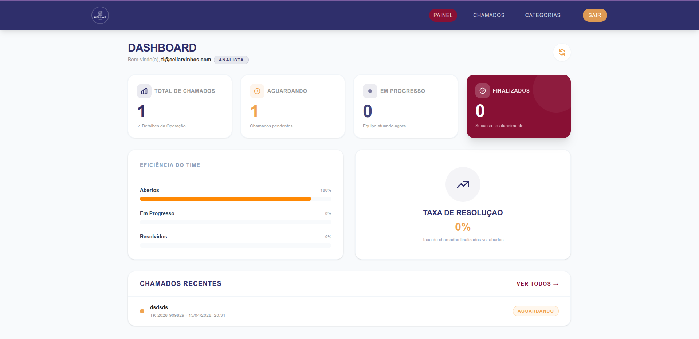
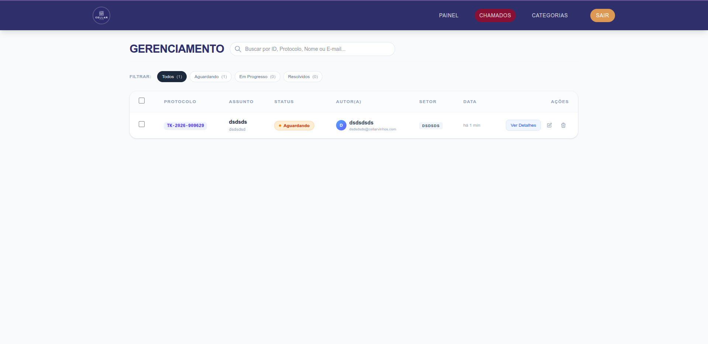
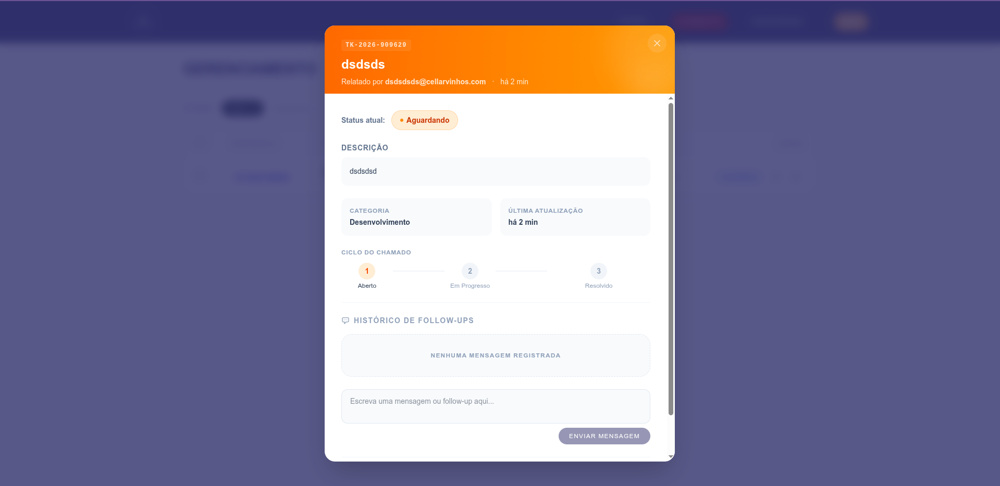
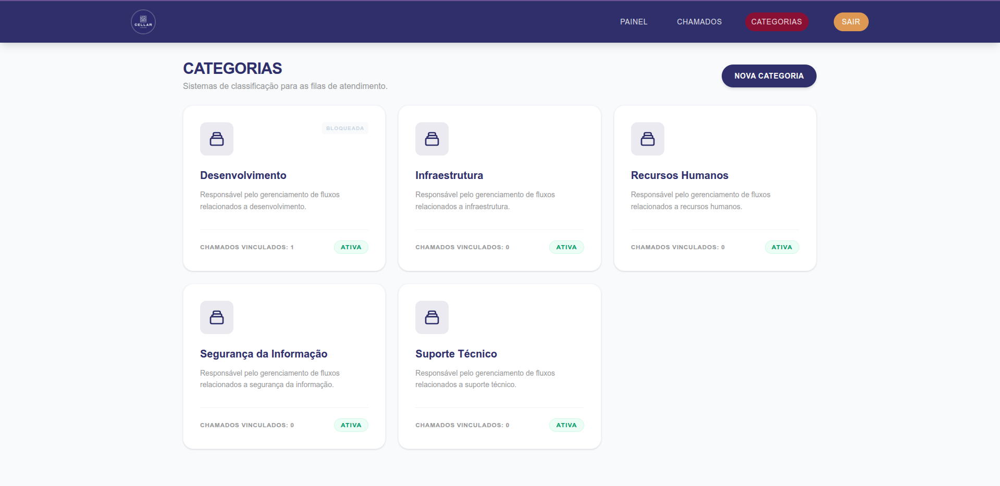
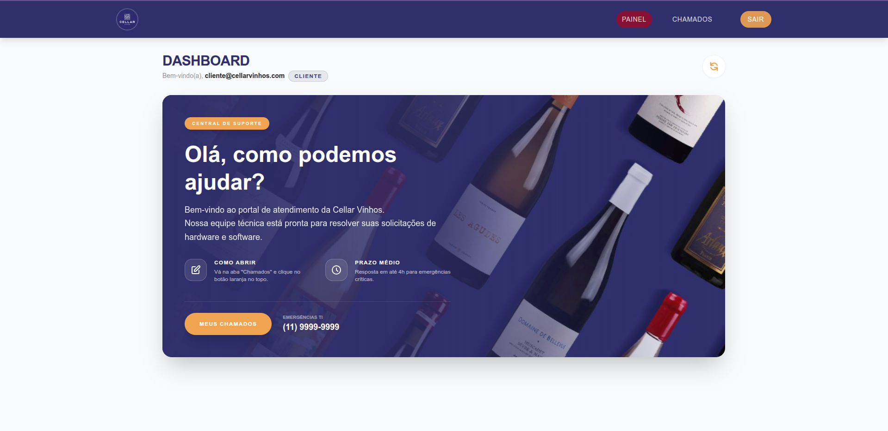

# 🍷 Cellar Vinhos - Gestão de Chamados (TI)

Sistema premium de gestão de chamados desenvolvido para a **Cellar Vinhos**, focado em eficiência operacional, comunicação clara e design de alta fidelidade.

## 🖼️ Visual do Projeto (Screenshots)

### 📊 Painel do Analista


### 📋 Listagem e Gestão de Chamados


### 💬 Comunicação e Follow-up (Messenger)


### 📁 Gestão de Categorias


### 🏠 Área do Cliente


## 🛡️ Segurança de Elite (Hardening Executado)

O sistema foi endurecido contra ataques comuns e tentativas de reconhecimento:
- **Backend Obfuscation:** Bloqueio de scanners de vulnerabilidades (Nmap, Nuclei) e restrição de acesso por Host.
- **Proteção Ativa contra XSS:** Middleware recursivo de sanitização em todas as entradas de dados.
- **API Stealth Mode:** Remoção de cabeçalhos tecnológicos (`X-Powered-By`, `Server`) e fallback silencioso para rotas inexistentes.
- **Honeypots Integrados:** Armadilhas configuradas em rotas comuns de ataque (`wp-admin`, `phpmyadmin`) para identificação de bots.
- **Security Headers (Helmet-style):** CSP estrita, HSTS, X-Frame-Options e Permissions-Policy configurados.
- **Testes de Segurança:** Suíte de testes automatizados com PHPUnit validando cada camada de proteção.


## 🚀 Funcionalidades Principais

### Para o Analista (T.I)
- **Dashboard Estratégico:** KPIs em tempo real (Total, Aguardando, Em Progresso, Resolvidos) com gráficos de eficiência.
- **Busca Avançada (Lupa):** Encontre qualquer ticket instantaneamente por ID, Protocolo (TK-2026...), Nome do Requisitante ou E-mail.
- **Gestão de Categorias:** Controle total sobre as categorias de atendimento.
- **Ações em Massa:** Exclusão múltipla de chamados para limpeza de base.
- **Sistema de Follow-up:** Chat interno dentro de cada chamado para comunicação direta com o cliente.

### Para o Cliente (Colaborador)
- **Interface Intuitiva:** Abertura simplificada de chamados com campos de Setor e Identificação.
- **Acompanhamento de Status:** Visualização clara do ciclo de vida do chamado.
- **Histórico de Comunicação:** Veja cronologicamente todas as interações do suporte no seu chamado.

## 🛠️ Stack Tecnológica

- **Backend:** Laravel 11 + Clean Architecture + PostgreSQL (Supabase).
- **Frontend:** Vue.js 3 + Vite + Tailwind CSS (Aesthetics v4).
- **Icons & Design:** Lucide Icons + HeroIcons + Custom Glassmorphism UI.
- **Docs:** [OpenAPI/Swagger Interactive](https://editor.swagger.io/?url=https://raw.githubusercontent.com/Assad-Lz/App-de-Gest-o-de-Chamados-em-Lavarel/main/backend/openapi.yml) (disponível também em `/backend/openapi.yml`).

## 📦 Instalação e Execução

### 📋 Pré-requisitos
Antes de começar, você precisará ter instalado em sua máquina:
- **PHP 8.3+** e extensões (mbstring, xml, curl, pgsql, zip).
- **Composer** (Gerenciador de pacotes PHP).
- **Node.js 20+** e **npm**.
- **PostgreSQL** (ou conta no Supabase para banco remoto).

### 🚀 Passo a Passo

#### 0. Clonar o Repositório
Escolha um diretório em sua máquina e execute:
```bash
git clone https://github.com/Assad-Lz/App-de-Gest-o-de-Chamados-em-Lavarel.git
cd App-de-Gest-o-de-Chamados-em-Lavarel
```

#### 1. Configurar o Backend (Laravel)
```bash
cd backend

# Instalar dependências
composer install

# Configurar ambiente
cp .env.example .env
php artisan key:generate

# ⚠️ Configure suas credenciais de banco de dados no arquivo .env
# (DB_HOST, DB_DATABASE, DB_USERNAME, DB_PASSWORD)

# Rodar as migrações e seeds (dados iniciais)
php artisan migrate --seed

# Iniciar o servidor
php artisan serve
```
A API estará rodando em: `http://localhost:8000`

#### 2. Configurar o Frontend (Vue.js)
Abra um novo terminal na raiz do projeto:
```bash
cd frontend

# Instalar dependências
npm install

# Iniciar o servidor de desenvolvimento
npm run dev
```
O Frontend estará disponível em: `http://localhost:5173`

#### 3. Executar Testes de Segurança
Para garantir que as proteções de Hardening estão ativas:
```bash
cd backend
php artisan test tests/Feature/Security/SecurityTest.php
```

## 📐 Decisões de Arquitetura (Clean Architecture)
O projeto segue princípios de DDD e Arquitetura Limpa:
- **Domain:** Entidades puras e lógica de negócio central.
- **Application:** Casos de uso (UseCases) que orquestram o fluxo de dados.
- **Infrastructure:** Repositórios Eloquent e integrações externas.
- **Presentation:** Controladores de API e Resources para entrega de dados.

## 📈 Melhorias UX/UI Implementadas
1. **Scrolling de Modais:** Modais inteligentes que se adaptam à altura da tela sem "grudar" nas bordas.
2. **Skeleton Loaders:** Feedback visual durante o carregamento de dados (fim do "flash" branco).
3. **Relative Time (FormatDate):** Datas amigáveis como "há 2 horas" para maior agilidade na leitura.
4. **Empty States Ilustrados:** Mensagens claras quando não há dados para exibir.
5. **Interactive Dashboard:** Cards com efeitos de escala, sombras dinâmicas e transições de cor no hover.
6. **Filtros Reativos:** Mudança de status instantânea com contador de itens em cada filtro.
7. **Cross-Origin Resiliency:** Configuração de CORS expandida para suportar múltiplos ambientes de dev.
8. **Feedback de Operação:** Toasts de sucesso/erro integrados em todas as ações críticas.
9. **UI Glassmorphism:** Uso de desfoque de fundo (backdrop-blur) em modais e navegação para profundidade.
10. **Mobile First:** Interface totalmente responsiva para tablets e smartphones.

## 🤖 Desenvolvimento e Configurações de Agente

Este projeto foi desenvolvido utilizando a **IDE Antigravity**, integrando capacidades avançadas de codificação assistida por IA.
- **Agent Rules:** O repositório contém diretrizes específicas para agentes de IA (localizadas em `.agents/` ou `.cursorrules`), garantindo que a manutenção do código siga padrões rigorosos de arquitetura limpa e estética visual.
- **Workflow Assistido:** Todo o processo de design, refatoração de UX e documentação OpenAPI foi orquestrado via Antigravity, maximizando a produtividade e qualidade do entregável.

---
**Desenvolvido para o Teste Técnico - Desenvolvedor Sênior PHP/Laravel.**

## 📄 Licença

Este projeto está licenciado sob a licença **Creative Commons Attribution-NonCommercial-ShareAlike 4.0 International (CC BY-NC-SA 4.0)**.

- **Uso Permitido:** Apenas para fins educacionais, estudos e demonstração de portfólio.
- **Proibido:** Uso comercial ou qualquer atividade com fins lucrativos utilizando este código.
- **Alterações:** Permitidas, desde que mantida a mesma licença e atribuído o crédito original.

---

[Política de Privacidade](./PRIVACY.md) | [Termos de Uso](./TERMS.md) | [Segurança](./SECURITY.md)
